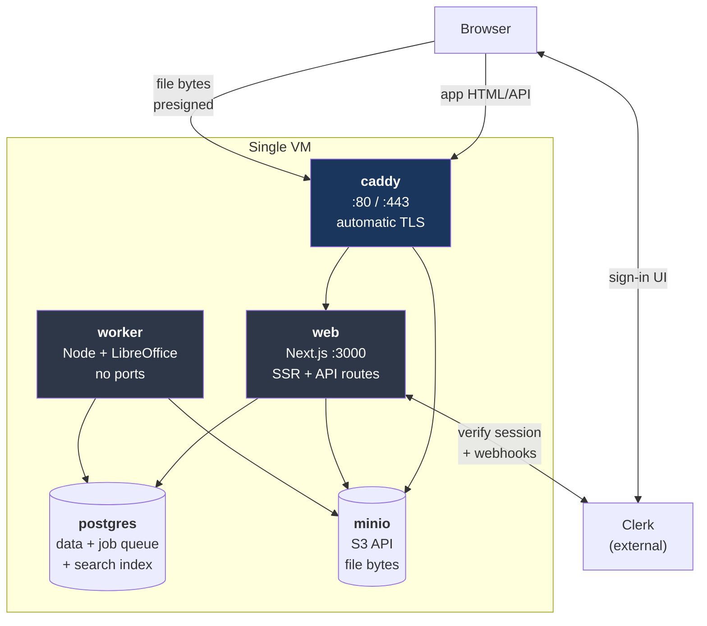
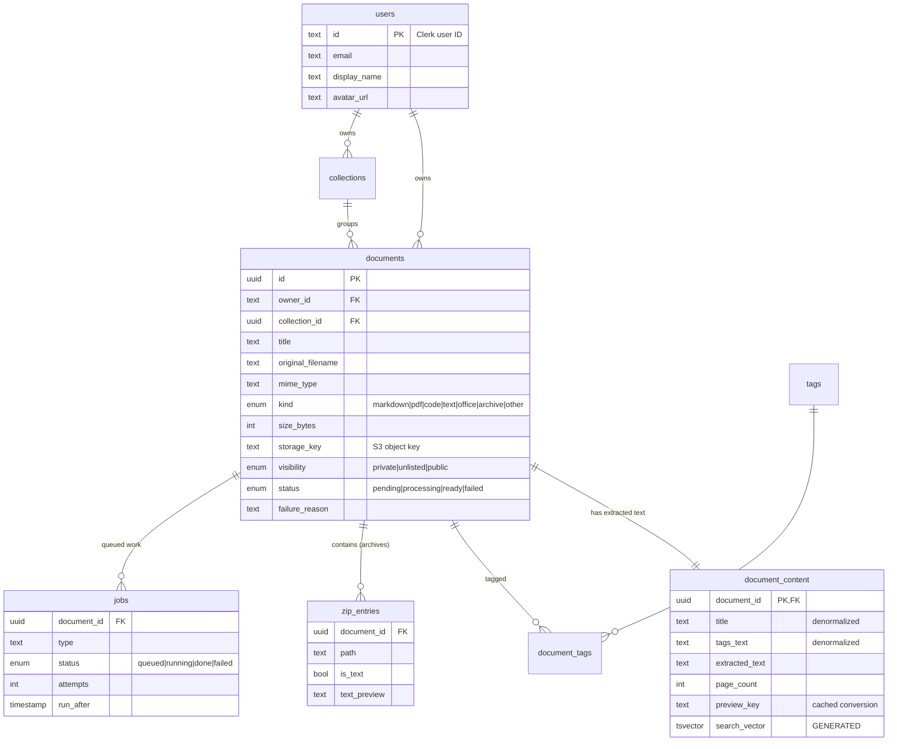
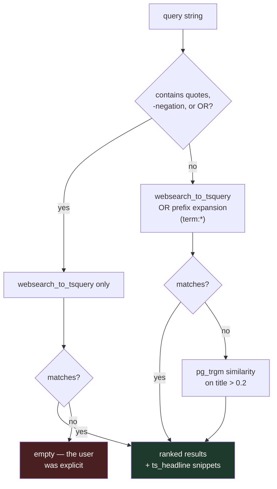
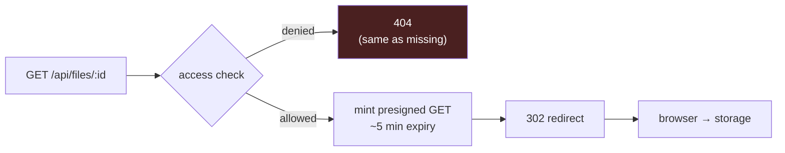
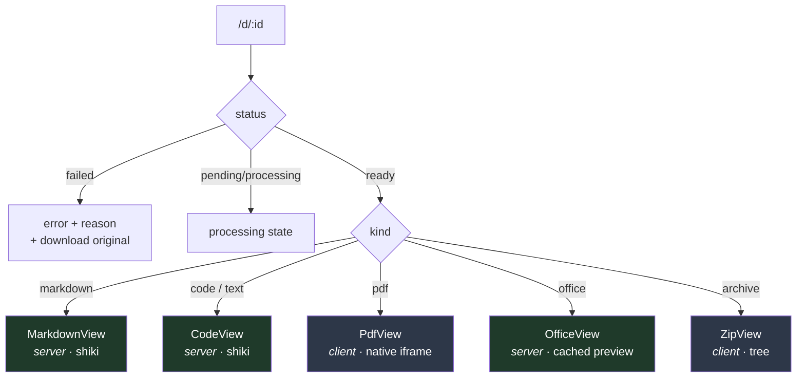

# Loredex — Architecture

How the system is put together, and why it is put together that way.

For what it does, see [README.md](./README.md). For deploying it, see
[DEPLOY.md](./DEPLOY.md).

---

## Contents

1. [The problem](#1-the-problem)
2. [System topology](#2-system-topology)
3. [Data model](#3-data-model)
4. [Search](#4-search)
5. [The upload and extraction pipeline](#5-the-upload-and-extraction-pipeline)
6. [Security model](#6-security-model)
7. [Rendering](#7-rendering)
8. [Failure handling](#8-failure-handling)
9. [Limits and scaling](#9-limits-and-scaling)
10. [File map](#10-file-map)
11. [Decisions and rejected alternatives](#11-decisions-and-rejected-alternatives)

---

## 1. The problem

Useful material accumulates across projects — setup notes, prompt guides,
reference PDFs, zipped boilerplate — and it ends up stranded in directories
nobody opens again. Filename search does not help, because you rarely remember
what you called it. You remember *what was in it*.

So the system is built around one requirement:

> Searching `docker` must return a zip from two years ago, because there is a
> Dockerfile inside it.

Almost every design decision below follows from that. It forces text extraction
from every format including archives, which forces background processing, which
forces a job queue. It forces full-text search over extracted content rather
than metadata. And it forces in-browser rendering, because a search result you
have to download to read is barely better than the folder you started with.

### Non-goals

Stated explicitly, because they shape the design as much as the goals do:

- **Not a document editor.** Files are immutable once uploaded. This removes
  version conflicts, collaborative editing, and locking from the design.
- **Not real-time.** A document being searchable a few seconds after upload is
  fine. This is what makes an asynchronous worker acceptable.
- **Not high-volume.** A personal library is hundreds to low thousands of
  documents, with a handful of uploads a day. This justifies a Postgres-backed
  job queue over a dedicated broker, and single-node Postgres full-text search
  over a search cluster.

---

## 2. System topology

Five containers on one machine. Only the reverse proxy is exposed.



| Container | Role | Why it is separate |
|---|---|---|
| `caddy` | TLS termination, routing | Automatic Let's Encrypt certificates and renewal — the entire reason it is here rather than nginx |
| `web` | SSR pages, API routes, server actions | — |
| `worker` | Text extraction, format conversion | Extraction takes seconds to minutes; in a request that means timeouts |
| `postgres` | Relational data, full-text index, job queue | — |
| `minio` | File bytes over the S3 API | Databases are poor at large binaries; S3 API keeps storage swappable |

`web` and `worker` are **the same image** with different commands. They share
all their code, so building them separately would duplicate ~1.4 GB for nothing.

### Two hostnames, deliberately

`loredex.example.com` serves the app; `s3.loredex.example.com` serves storage.
Both are proxied by the same Caddy instance, but the storage host is publicly
reachable so the **browser can talk to storage directly**. See
[§5](#5-the-upload-and-extraction-pipeline) for why that matters.

This is also why `S3_ENDPOINT` and `S3_PUBLIC_ENDPOINT` are separate settings:
the server reaches MinIO at `http://minio:9000` over the internal network, but a
URL signed for that host is invalid when the browser requests it from
`https://s3.loredex.example.com`. Signing with the wrong hostname produces a
signature the storage server rejects, and the error message does not hint at
the cause.

---

## 3. Data model



### Why `document_content` is a separate table

Extracted text runs to megabytes. Keeping it in `documents` would make every
listing query — the home page, collections, search result metadata — drag that
payload along. Splitting it means the hot queries touch only narrow rows.

### Why `title` and `tags_text` are duplicated onto it

`search_vector` is a Postgres **generated column**, and generated columns may
only reference other columns *in the same row*. To rank a title match above a
body match, the title has to physically live on the same row as the body text.

This is the one place the schema trades normalisation for search quality, and
it has a sharp edge: **rename a document without updating the copy and it
silently stops being findable under its new name while still displaying
correctly.** Both write paths handle it — `renameDocument` in
`src/app/actions/documents.ts` and `setDocumentTags` in `src/lib/tags.ts` — and
`AGENTS.md` flags it for future work.

### Why `zip_entries` exists

An archive is indexed twice over: its contents feed the parent document's
search vector, *and* each entry is stored as a row. That second part is what
lets the viewer render a file tree and open a file inside the zip without
re-downloading and re-parsing the archive on every click.

---

## 4. Search

The core of the product, and the part with the most non-obvious decisions.

### The index

`document_content.search_vector` is a generated, stored `tsvector` with three
weighted inputs:

```sql
setweight(to_tsvector('english', coalesce(title,        '')), 'A') ||
setweight(to_tsvector('english', coalesce(tags_text,    '')), 'B') ||
setweight(to_tsvector('english', coalesce(extracted_text,'')), 'C')
```

Postgres maintains it on every write; application code never touches it. A GIN
index makes matching fast, and `ts_rank_cd` uses the weights so a title hit
outranks a tag hit, which outranks a passing mention in the body.

### The query cascade



Three behaviours worth explaining:

**`websearch_to_tsquery`, not `plainto_tsquery`.** It gives users the syntax
they already know from search engines: `"multi stage"` for a phrase,
`docker -compose` to exclude.

**Prefix expansion.** English stemming reduces *Dockerfile* to `dockerfil`.
The term *docker* does not match that. Without prefix expansion, a zip
containing a Dockerfile is invisible to a search for "docker" — the exact case
the app exists to serve. So each term is also OR-ed in as `term:*`. It is OR-ed
rather than substituted so that exact matches still rank higher.

**Operators disable the clever parts.** If a user writes `docker -compose`,
prefix expansion and the fuzzy fallback are both switched off. Both would
otherwise reintroduce the document the user just excluded — the fallback
matched it on title similarity, which is precisely the bug the end-to-end tests
caught.

### One more tokenisation trap

Postgres classifies `oldproject/Dockerfile` as a **file path** token, producing
the single lexeme `oldproject/dockerfile`. No prefix search can reach the
`Dockerfile` part of it.

So the zip extractor indexes every path twice — whole, and split into
segments — giving the stemmer a bare `dockerfil` token to work with. Without
this, prefix expansion alone does not fix archive search.

### Snippets are an injection surface

`ts_headline` marks matches in the source text, but **does not escape that
text**. Asking it for `<mark>` tags directly would mean a document containing
`<script>` gets that script rendered into the results page of anyone who
searches.

The mitigation:

1. Postgres marks matches with `chr(2)` and `chr(3)` — control bytes that
   cannot survive `sanitizeText()` during extraction, so no document can forge
   them.
2. `highlightToHtml()` HTML-escapes the entire string.
3. *Then* the two sentinels become real `<mark>` tags.

The result provably contains no markup that did not originate in our code. It
is applied inside `toHit()`, the single funnel every search result passes
through, so no caller can forget it.

---

## 5. The upload and extraction pipeline

```mermaid
sequenceDiagram
    participant B as Browser
    participant W as web
    participant S as MinIO
    participant D as Postgres
    participant K as worker

    B->>W: POST /api/uploads/presign
    W->>W: auth + size check
    W-->>B: presigned PUT URL + document id

    rect rgb(45, 55, 72)
    Note over B,S: file bytes never touch the app
    B->>S: PUT file (direct, with progress)
    end

    B->>W: POST /api/uploads/complete
    W->>S: HEAD — did it really land?
    W->>D: INSERT document (status=pending)
    W->>D: INSERT job (type=extract)
    W-->>B: 200 — returns immediately

    loop poll every 1.5s
        B->>W: GET /api/documents/status
    end

    K->>D: claim job (FOR UPDATE SKIP LOCKED)
    K->>D: status = processing
    K->>S: GET file bytes
    K->>K: extract text (+ convert preview)
    K->>S: PUT cached preview
    K->>D: write content, entries, status = ready
    Note over D: search_vector regenerates automatically

    B->>W: GET /api/documents/status
    W-->>B: ready
```



### Why the browser uploads directly to storage

The app issues a presigned URL; the browser PUTs the bytes straight to MinIO.
A 300 MB archive therefore costs the Next.js process nothing — no memory, no
request timeout, no body-size limit to raise. It also means upload throughput is
independent of application load.

The cost is a cross-origin request, which is why storage needs its own
public hostname and a CORS policy. MinIO does not implement the S3
`PutBucketCors` API, so that policy is server configuration
(`MINIO_API_CORS_ALLOW_ORIGIN`), not a bucket setting. Getting it wrong
produces an opaque browser network error that looks nothing like a
configuration problem — which is why `scripts/init-storage.ts` performs a real
presigned PUT at setup time rather than trusting it.

`/api/uploads/complete` issues a `HEAD` before creating the row. Without it, a
failed browser upload leaves a document pointing at nothing, and the failure
surfaces later as a confusing extraction error rather than an upload one.

### The job queue

A `jobs` table drained by the worker:

```sql
UPDATE jobs SET status='running', attempts = attempts + 1
WHERE id = (
  SELECT id FROM jobs
  WHERE status='queued' AND run_after <= now()
  ORDER BY run_after
  FOR UPDATE SKIP LOCKED       -- concurrent workers step over each other
  LIMIT 1
)
RETURNING ...
```

`FOR UPDATE SKIP LOCKED` makes the claim atomic: multiple worker replicas can
run without double-processing or blocking each other. Failures back off
exponentially (15s, 30s, 60s) and after three attempts mark the document
`failed` with the reason stored for display.

Redis and BullMQ were rejected: one more container to run, secure, and back up,
for a workload of a few uploads a day. Postgres already provides the durability
and the locking primitive.

### Extraction by format

| Format | Text | Preview | Cost |
|---|---|---|---|
| `.md`, `.txt`, code | UTF-8 read | rendered client-side | trivial |
| `.pdf` | pdf.js text layer | original streamed to browser | moderate |
| `.docx` | mammoth | mammoth → sanitized HTML | fast |
| `.xlsx`, `.csv` | SheetJS | SheetJS → HTML tables | fast |
| `.pptx`, `.doc`, `.xls`, legacy | via the converted PDF | LibreOffice → PDF | **slow, memory-hungry** |
| `.zip` | entry paths + contents of small text entries | in-app tree | moderate |

The split matters. `.docx` and `.xlsx` — the overwhelming majority of Office
uploads — are handled in pure JavaScript. Only PowerPoint and the legacy binary
formats shell out to LibreOffice, which is slow, memory-hungry, and the single
reason this application must ship as a container image rather than deploy to a
serverless platform.

Extraction is capped at 2 MB of text per document. Postgres has a hard 1 MB
limit per `tsvector`, and beyond that term frequency flattens and ranking gets
worse, not better.

---

## 6. Security model

### Authentication

Clerk owns identity entirely — no password hashing, no session storage, no
email verification in this codebase. `proxy.ts` (Next.js 16's renamed
middleware) verifies the session cookie's JWT locally against Clerk's public
key, so there is no network round-trip per request.

The local `users` table exists only so documents have something to join against
for "uploaded by", and so deleting a Clerk account cascades. It is kept in sync
by a webhook, with `ensureLocalUser()` as a fallback for when the webhook is
delayed, dropped, or not yet configured — otherwise a missing row breaks the
foreign key on someone's very first upload.

**The webhook endpoint is public and unauthenticated**, because Clerk cannot
hold a session. Its Svix signature *is* the authentication; unverified payloads
are rejected with 400.

### Authorization

`proxy.ts` is an optimistic gate for UX — it bounces signed-out users to
sign-in rather than showing an empty page. **It is not the security boundary.**

Every read and write independently enforces access through one module,
`src/lib/access.ts`:

| Helper | Used for | Rule |
|---|---|---|
| `canReadFilter` | fetching by ID | own, or public, or **unlisted** |
| `canDiscoverFilter` | search and listings | own, or public — **never** others' unlisted |
| `getReadableDocument` | the viewer, file redirect | applies `canReadFilter` |
| `requireOwnedDocument` | every mutation | owner only |

The read/discover split is what makes "unlisted" mean anything: reachable by
anyone holding the link, but absent from everyone else's search results.

Two deliberate details: `requireOwnedDocument` returns the same error whether a
document is missing or simply someone else's, so responses never confirm which
IDs exist. And `/api/uploads/complete` verifies the submitted storage key is
prefixed with the caller's own user ID, so nobody can claim another user's
uploaded object as their document.

### File access



The application authorizes, then redirects to a short-lived signed URL. It never
proxies file bytes. A leaked URL expires in minutes.

### Untrusted content

Three places where content we did not author becomes HTML, and what guards each:

| Source | Risk | Mitigation |
|---|---|---|
| `ts_headline` snippets | source text is not escaped | control-byte sentinels + escape ([§4](#4-search)) |
| Office → HTML previews | mammoth/SheetJS output derives from a user's file | `sanitize-html` tag/attribute whitelist, applied **in the worker before it is ever stored** |
| Markdown | raw HTML, `javascript:` links | react-markdown does not render raw HTML by default; links forced to `rel="noopener noreferrer nofollow"` |

Sanitising Office HTML at ingest rather than at render means the stored artefact
is safe, so a future code path that forgets to sanitise cannot reintroduce the
hole.

---

## 7. Rendering

Almost everything renders on the server. Only three components ship
interactivity to the browser.



Client components: `upload-dropzone` (drag/drop, progress), `search-results`
(keyboard navigation), `zip-view` (tree expansion), `visibility-control`,
`search-box`. Everything else is a server component.

Syntax highlighting runs server-side via Shiki, so no highlighter bundle reaches
the browser and code is coloured on first paint. Since `react-markdown`'s
component map cannot be async, fenced blocks are highlighted up front and looked
up by content during render.

Office previews are rendered from the artefact the worker cached at ingest —
opening a `.pptx` is a read, never a conversion.

### Design system

Tailwind 4 is CSS-first, so `globals.css` *is* the design system: semantic
tokens (`--bg`, `--surface`, `--fg-muted`, `--accent`) defined once for light
and dark. Components use `bg-surface` and `text-fg-muted`, never raw palette
colours. One accent, used only for focus rings, active nav, and search
highlights; semantic colour reserved strictly for status.

---

## 8. Failure handling

| Failure | Behaviour |
|---|---|
| Extraction throws | 3 attempts with exponential backoff, then `status=failed` with the reason shown in the UI and a download-original fallback |
| Postgres unreachable | Worker logs and keeps looping — it recovers when the database returns rather than dying |
| Worker killed mid-job | Job stays `running`; currently needs manual reset (see below) |
| Browser upload fails | No document row is created — the `HEAD` check catches it |
| Storage delete fails | Row is still deleted; the orphaned object is logged. A visible-but-deleted document is worse than wasted bytes |
| LibreOffice OOM | Container `mem_limit: 3g` contains the damage; the job fails cleanly rather than taking the VM down |
| Clerk unreachable | Existing sessions continue until expiry; new sign-ins fail |

A failed extraction is deliberately loud. A document that silently never became
searchable is worse than one that visibly failed, because you only discover it
at the moment you needed it.

**Known gap:** a job whose worker is killed mid-execution stays `running`
forever. A reaper that requeues jobs stuck in `running` past a threshold is the
obvious fix and is not yet implemented.

---

## 9. Limits and scaling

Sized for a personal library. Where the design would strain:

| Dimension | Comfortable | Where it breaks |
|---|---|---|
| Documents | ~100k | Single-node Postgres FTS; ranking quality degrades before performance does |
| Text per document | 2 MB (enforced) | `tsvector` hard limit is 1 MB |
| Concurrent uploads | Many | Bytes bypass the app entirely |
| Extraction throughput | ~1 doc at a time | One worker; scales by adding replicas — `SKIP LOCKED` already supports it |
| Storage | 150 GB on the free tier | Swap `S3_ENDPOINT` for R2 or S3; no code change |
| Users | Thousands | Clerk's free tier is 10k MAU |

**The first thing to hit.** Extraction is the bottleneck, and the fix is
already available: run more `worker` containers. The queue was built for it.

**What would need real work.** Cross-language search (the index is hardcoded to
the `english` configuration), semantic/vector search, and document versioning —
which the immutability assumption in [§1](#1-the-problem) currently rules out.

---

## 10. File map

```
src/
├── proxy.ts                    Clerk auth gate (Next 16 renamed middleware.ts)
│
├── app/
│   ├── layout.tsx              ClerkProvider, fonts, theme class
│   ├── (app)/                  ── signed-in surfaces ──
│   │   ├── layout.tsx          ensureLocalUser + app shell
│   │   ├── page.tsx            search-first home
│   │   ├── search/             results + filters
│   │   ├── d/[id]/             viewer + metadata sidebar
│   │   ├── upload/             drag-drop upload
│   │   └── collections/        grouping by project
│   ├── p/[id]/                 public read-only page (no auth)
│   ├── sign-in/, sign-up/      Clerk components
│   ├── actions/documents.ts    server actions: visibility, rename, tags, delete
│   └── api/
│       ├── uploads/presign     mint a presigned PUT
│       ├── uploads/complete    record the document, queue extraction
│       ├── files/[id]          authorize → 302 to presigned GET
│       ├── documents/status    upload-page polling
│       ├── webhooks/clerk      Svix-verified user sync
│       └── health              dependency check for uptime monitoring
│
├── components/
│   ├── viewers/                one renderer per kind
│   ├── search-box, search-results, upload-dropzone, visibility-control
│   └── document-view.tsx       picks the renderer
│
├── db/
│   ├── schema.ts               tables, enums, generated search_vector
│   └── index.ts                lazy pooled connection
│
├── lib/
│   ├── access.ts        ★      the only place visibility rules are expressed
│   ├── queries.ts       ★      search, ranking, snippet sanitising
│   ├── s3.ts            ★      presigned URLs; the only storage-aware module
│   ├── auth.ts                 Clerk helpers + local user fallback
│   ├── file-kinds.ts           extension/MIME → kind, language mapping
│   ├── tags.ts                 tag writes + denormalized search copy
│   ├── highlight.ts            Shiki, one cached highlighter
│   └── env.ts                  validated, lazily read configuration
│
└── worker/
    ├── index.ts                job loop, claiming, retries, backoff
    └── extractors.ts    ★      per-format extraction and preview generation

scripts/
├── migrate.ts, init-storage.ts     setup (bundled into the image)
├── test-extractors.ts              7 checks, real files of each format
└── e2e-check.ts                    21 checks, full pipeline + access control
```

★ = the files that carry the most consequence. Changes here warrant running
`scripts/e2e-check.ts`.

### Configuration is lazy on purpose

Neither `db/index.ts` nor `lib/s3.ts` reads configuration at module scope.
`next build` imports every route to collect its metadata, so a module-level
`env()` call makes the *build* require runtime secrets and a reachable database.
Both construct their clients on first use instead. This is load-bearing: it was
a real build failure, not a hypothetical.

---

## 11. Decisions and rejected alternatives

| Decision | Rejected | Why |
|---|---|---|
| Postgres full-text search | Elasticsearch, Meilisearch, Typesense | One database to run, secure, and back up. `websearch_to_tsquery` + `pg_trgm` + `ts_headline` covers phrases, negation, typos, and snippets. A search cluster earns its keep at a scale a personal library never reaches. |
| No embeddings / vector search | pgvector, hosted embeddings | Adds an API key, per-document cost, and a re-indexing story. Keyword search over full contents already answers "how did I do Docker last time?". A clear later upgrade, not a v1 requirement. |
| Postgres job queue | Redis + BullMQ | One fewer container for a handful of uploads a day. `FOR UPDATE SKIP LOCKED` gives atomic claiming and multi-worker safety for free. |
| Clerk | Auth.js / Lucia / hand-rolled | Deletes an entire category of security work — password storage, resets, verification, MFA. The cost is a third-party dependency, bounded by `owner_id` being a plain string, so migrating means changing the login layer, not the data model. |
| MinIO (S3 API) | Filesystem, Cloudflare R2, AWS S3 | The API is what matters — presigned URLs keep bytes out of the app process. MinIO runs free on the same VM; switching to R2 or S3 is three environment variables. |
| Native PDF `<iframe>` | react-pdf / pdf.js viewer | react-pdf ships ~400 KB of worker bundle plus font assets to re-implement pagination, zoom, search, and printing that every browser already provides — accessibly, and for free. |
| `sanitize-html` | DOMPurify / isomorphic-dompurify | DOMPurify needs jsdom on the server; it made the worker bundle 13.9 MB. `sanitize-html` parses with htmlparser2 — same job, 2.5 MB. |
| Container deployment | Vercel / serverless | LibreOffice is required for PowerPoint and legacy Office formats. That needs a container image, which rules serverless out. Uploads and extraction would have needed reworking around request limits anyway. |
| Oracle Ampere free tier | AWS free tier | 4 cores / 24 GB free forever, versus 1 GB for 12 months. Postgres, MinIO, and LibreOffice do not coexist happily in 1 GB. |
| Caddy | nginx + certbot | Automatic HTTPS in two lines, with renewal handled. No cron job, no certificate expiry incident. |

---

## Verifying the system

```bash
pnpm typecheck
pnpm tsx scripts/test-extractors.ts   # 7 checks — needs `soffice` on PATH
pnpm tsx scripts/e2e-check.ts         # 21 checks — needs `pnpm worker` running
```

`e2e-check.ts` is the meaningful one. It creates two throwaway users and walks
the real path — presigned upload to MinIO, job queue, worker extraction — then
asserts search semantics (phrases, negation, typo tolerance, filters, archive
contents) and that one user cannot see another's private documents. It cleans up
after itself.

It has already earned its keep: it caught the archive tokenisation problem, the
negation bug, and the snippet injection risk. Run it after touching anything
marked ★ in [§10](#10-file-map).
